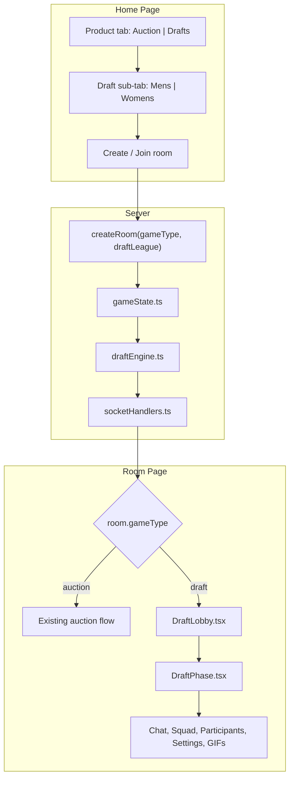
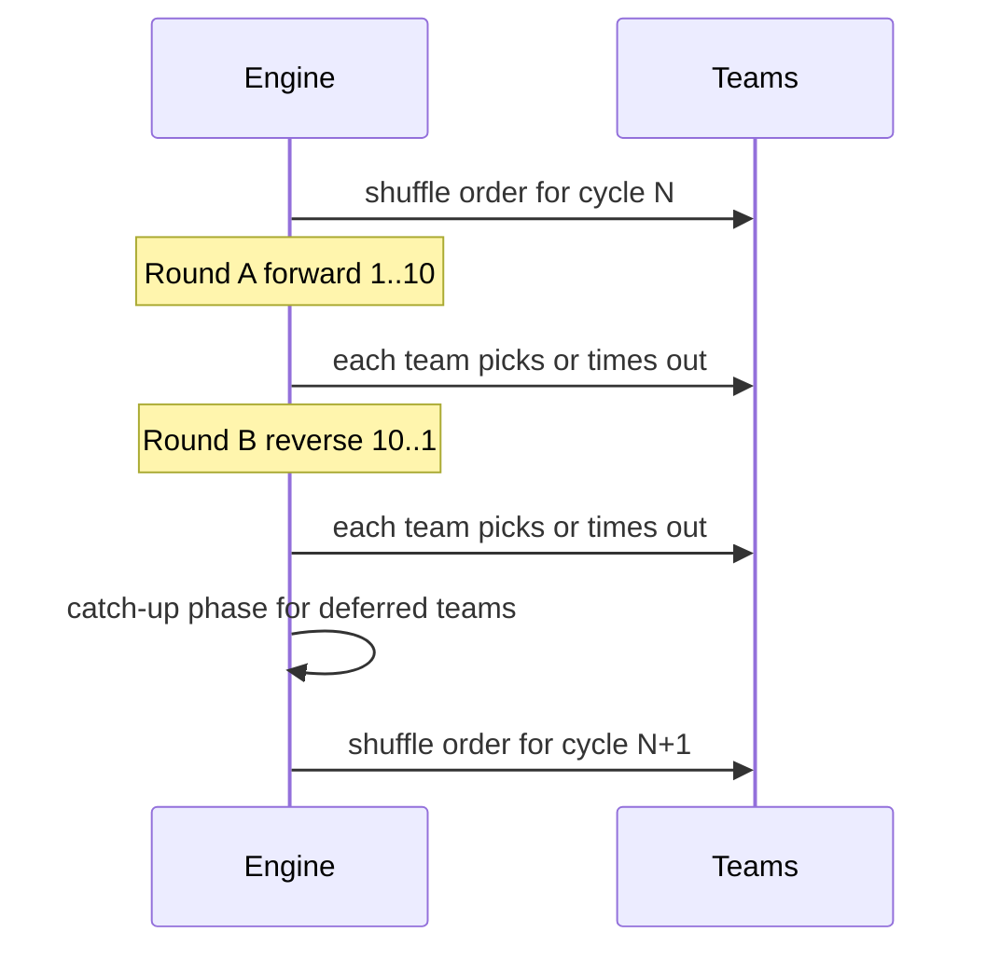
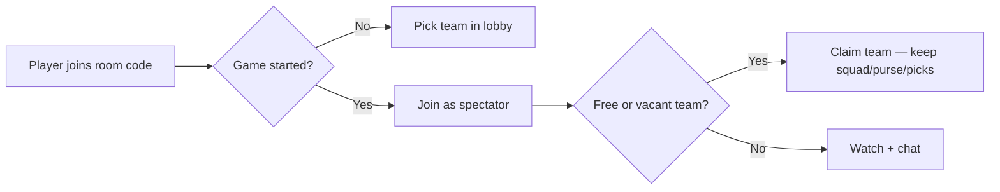

# Draft Mode — Full Implementation Plan

## Goal

Introduce a second game type alongside the existing auction, reachable from home via a **Drafts** tab with **Mens** / **Womens** (host picks at room creation). Draft rooms reuse the same Socket.io + room infrastructure but replace bidding with **search → pick → add to squad**, snake pick order with **re-shuffle after each full cycle**, and the same social layer (chat, GIFs, sounds, confetti, participants, settings).

---

## Architecture Overview



**Mens** maps to IPL player pool (`league: "ipl"`). **Womens** maps to WPL player pool (`league: "wpl"`). Draft ignores auction modes (mega/retention) and skips retention/RTM entirely.

---

## 1. Types and Room Model

Extend [`src/lib/types.ts`](d:\Onedrive\OneDrive - Sify Technologies Limited\Documents\IPL\ipl-auction\src\lib\types.ts):

| New type / field | Purpose |
|------------------|---------|
| `GameType = "auction" \| "draft"` | Branch all server + UI logic |
| `DraftGender = "mens" \| "womens"` | Host selection on create |
| `DraftTeamSlot` | `{ id, name, shortName, primaryColor, secondaryColor, logoUrl, logoEmoji?, ownerId?, isCustom }` — fully user-defined branding |
| `DraftState` | Pick order, cycle, round direction, current picker, available pool IDs, deferred picks map, phase (`lobby` \| `draft` \| `catchup` \| `completed`), pick number |
| `RoomState.gameType`, `draftGender`, `draft`, `draftTeams`, `pickTimerSeconds` | Client-visible state |
| `CreateRoomPayload.gameType`, `draftGender` | Socket create payload |

Draft squad rules (user-specified, uniform for Mens/Womens):

- **Min squad:** 18
- **Max squad:** 25
- **No overseas cap** — any player from the pool can be drafted regardless of nationality
- **No purse / no prices** in draft UI (players added at zero cost)

Server-only `Room` in [`src/server/gameState.ts`](d:\Onedrive\OneDrive - Sify Technologies Limited\Documents\IPL\ipl-auction\src\server\gameState.ts) gains `gameType`, `draft`, `draftTeamSlots`, `pickTimerInterval`.

---

## 2. Pakistani Player Removal (All Modes)

**Data cleanup:**

- Remove 3 Pakistani entries from [`src/data/leagues/wpl/players.json`](d:\Onedrive\OneDrive - Sify Technologies Limited\Documents\IPL\ipl-auction\src\data\leagues\wpl\players.json) (Diana Baig, Nida Dar, Fatima Sana)
- Remove Naseem Shah from [`src/data/leagues/hundred/players.json`](d:\Onedrive\OneDrive - Sify Technologies Limited\Documents\IPL\ipl-auction\src\data\leagues\hundred\players.json)
- Update [`scripts/generate-league-players.mjs`](d:\Onedrive\OneDrive - Sify Technologies Limited\Documents\IPL\ipl-auction\scripts\generate-league-players.mjs) so regeneration never re-adds them

**Runtime safety net** (prevents future data regressions):

- Add `filterExcludedCountries()` in [`src/data/playerLoader.ts`](d:\Onedrive\OneDrive - Sify Technologies Limited\Documents\IPL\ipl-auction\src\data\playerLoader.ts) and mirror in `loadPlayersForLeague()` in `gameState.ts`
- Exclude `country === "Pakistan"` everywhere players are loaded (auction + draft)

---

## 3. Draft Team Lobby (10 slots + full custom branding)

**New file:** `src/lib/draftTeamNames.ts` — pool of ~40 cricket-themed fantasy names; `generateDraftTeamSlots(10)` returns shuffled defaults with random preset colors.

**New component:** `src/components/DraftLobby.tsx`  
**New component:** `src/components/DraftTeamEditor.tsx` — inline editor for name, colors, logo

Host flow at room creation:

1. Room starts with **10 pre-generated fantasy team names** (editable inline by host before start)
2. Host can **rename**, **recolor**, and **set logo** on any slot; **add slots** beyond 10 if more players join
3. Each joining player claims a free slot or creates a new custom slot (if all 10 taken) and customizes:
   - **Team name** (free text)
   - **Primary / secondary colors** (color picker or preset swatches)
   - **Custom logo** via one of: emoji picker, initials avatar (auto from name), or image URL paste
   - Optional shortcut: "Use franchise look" copies IPL/WPL colors + logo as a starting point, then fully editable
4. Reuse [`InviteFriendsCard`](d:\Onedrive\OneDrive - Sify Technologies Limited\Documents\IPL\ipl-auction\src\components\InviteFriendsCard.tsx), [`ChatPanel`](d:\Onedrive\OneDrive - Sify Technologies Limited\Documents\IPL\ipl-auction\src\components\ChatPanel.tsx), [`ParticipantsTab`](d:\Onedrive\OneDrive - Sify Technologies Limited\Documents\IPL\ipl-auction\src\components\ParticipantsTab.tsx), [`GifPicker`](d:\Onedrive\OneDrive - Sify Technologies Limited\Documents\IPL\ipl-auction\src\components\GifPicker.tsx)

**New socket events:**

- `claim-draft-team` — `{ slotId, name?, primaryColor?, secondaryColor?, logoUrl?, logoEmoji? }`
- `edit-draft-team` — host or slot owner edits branding (lobby only for others; owner can edit name/colors mid-draft if desired — lobby-only for logo to avoid confusion)
- `add-draft-team-slot` — host adds slot when >10 players
- `release-draft-team` — leave slot in lobby (rejoin picks same slot via session token)
- `takeover-draft-team` — mid-draft claim of vacant slot (inherits squad + pick position)

Lobby → draft transition: host clicks **Start Draft** when at least 2 teams claimed (host can force-start like auction).

---

## 4. Draft Engine (Core Logic)

**New file:** `src/server/draftEngine.ts`

### Pick order (per your choice: re-shuffle each cycle)



- **Cycle** = forward round + reverse round + catch-up
- After each cycle, **re-shuffle** team order and broadcast `draft-order-updated` activity
- UI shows live order board: `1 CSK Kings → 2 … → 10 …` with current picker highlighted

### Timer

- Reuse pick timer options **5 / 10 / 15 / 20 / 25 / 30** seconds (same UX as [`RoomSettingsTab`](d:\Onedrive\OneDrive - Sify Technologies Limited\Documents\IPL\ipl-auction\src\components\RoomSettingsTab.tsx), relabeled "Pick Timer")
- Host sets via existing `host-action: set-timer` mapped to `pickTimerSeconds` for draft rooms

### Pick flow

1. `make-draft-pick` `{ playerId }` — only current picker; validates: player available, squad < 25, not already drafted (**no overseas check**)
2. On success: add to team squad, remove from pool, emit `draft-pick` activity, advance turn, reset timer
3. On timer expiry: increment `deferredPicks[teamId]`, advance turn (no auto-random pick)

### Catch-up phase (missed picks)

After each **reverse round** completes:

- Enter `catchup` sub-phase for teams with `deferredPicks > 0`
- Process deferred teams in shuffled order; each gets a pick timer turn
- They may pick **one player per catch-up turn** until `deferredPicks` reaches 0
- If they miss again during catch-up, increment deferred count (processed again next cycle end)
- User can pick **multiple catch-up players across consecutive catch-up turns** until roster constraints satisfied

### Draft completion

- Draft ends when **every team has ≥ 18 players** AND all teams pass (or host ends draft) OR pool exhausted
- Teams may continue picking up to **25** while their turn comes up
- Host action: `end-draft` forces completion if all teams ≥ 18

### Reconnect / leave

- Leverage existing [`reconnectByToken`](d:\Onedrive\OneDrive - Sify Technologies Limited\Documents\IPL\ipl-auction\src\server\gameState.ts) — restore `teamId` / draft slot
- **Mid-game join:** new joiners enter as spectators, then can **claim any open/vacant team** and continue drafting (see Section 11)
- Offline owner: team stays in order with existing squad; timer expires → deferred; slot becomes **vacant** if host kicks or prolonged offline policy applies

---

## 5. Draft UI (Replaces Bid UI)

**New file:** `src/components/DraftPhase.tsx`

Main draft screen (mirrors auction layout in [`room/[roomId]/page.tsx`](d:\Onedrive\OneDrive - Sify Technologies Limited\Documents\IPL\ipl-auction\src\app\room\[roomId]\page.tsx)):

| Area | Content |
|------|---------|
| Top strip | Current picker team badge, pick #, round direction, countdown timer |
| Order board | Collapsible snake order for current cycle |
| Search + pool | Filter by name, role, country; exclude already drafted |
| Player row | Role, country badge — **Draft** button (only enabled on your turn) |
| Bottom nav | Chat · Squad · Users · Settings (same as auction) |

**Reuse with adapters:**

- [`AuctionChatTab`](d:\Onedrive\OneDrive - Sify Technologies Limited\Documents\IPL\ipl-auction\src\components\AuctionChatTab.tsx) — pass `gameType="draft"` for labels
- [`SquadTab`](d:\Onedrive\OneDrive - Sify Technologies Limited\Documents\IPL\ipl-auction\src\components\SquadTab.tsx) — works as-is (no prices shown if squad entries have `price: 0`)
- [`BidToastStack`](d:\Onedrive\OneDrive - Sify Technologies Limited\Documents\IPL\ipl-auction\src\components\BidToastStack.tsx) — extend activity kinds: `DRAFT_PICK`, `PICK_MISSED`, `ORDER_SHUFFLED`
- [`fireSoldConfetti`](d:\Onedrive\OneDrive - Sify Technologies Limited\Documents\IPL\ipl-auction\src\lib\confetti.ts) + [`sounds.ts`](d:\Onedrive\OneDrive - Sify Technologies Limited\Documents\IPL\ipl-auction\src\lib\sounds.ts) — trigger on successful pick (reuse sold sound or add `playDraftPickSound`)

**New overlays:** `DraftOverlays.tsx` — "Your pick!", "Pick missed — catch-up later", order shuffle announcement.

**Remove for draft:** `StickyBidBar`, RTM overlays, `AuctionPlayerStrip` bid buttons, retention phase, upcoming-lot modal (replace with searchable full pool drawer).

---

## 6. Home Page — Drafts Tab

Update [`src/app/page.tsx`](d:\Onedrive\OneDrive - Sify Technologies Limited\Documents\IPL\ipl-auction\src\app\page.tsx):

```
[ Auction ] [ Drafts ]     ← new top product tab
```

When **Drafts** selected:

- Show **Mens** / **Womens** sub-tabs (not IPL/WPL/Hundred)
- Hide auction mode cards (mega/retention)
- `create-room` payload: `{ gameType: "draft", draftGender: "mens"|"womens", playerName }`
- Header title adapts: "DRAFT" instead of "AUCTION"
- Recent rooms show draft badge + gender

---

## 7. Server Socket Handlers

Extend [`src/server/socketHandlers.ts`](d:\Onedrive\OneDrive - Sify Technologies Limited\Documents\IPL\ipl-auction\src\server\socketHandlers.ts):

| Event | Handler |
|-------|---------|
| `create-room` | Branch on `gameType`; init draft slots + empty `DraftState` |
| `claim-draft-team`, `edit-draft-team`, `add-draft-team-slot` | Lobby mutations |
| `start-game` | If draft: skip retention → `startDraft()` |
| `make-draft-pick` | Delegates to `draftEngine.processPick()` under `withRoomLock` |
| `host-action` | Map `set-timer`, `pause`, `resume`, `end-draft`, `kick` for draft |
| `timer-tick` | Existing interval driver calls draft timer decrement |

Update [`src/server/roomPersistence.ts`](d:\Onedrive\OneDrive - Sify Technologies Limited\Documents\IPL\ipl-auction\src\server\roomPersistence.ts) to serialize/deserialize `gameType`, `draft`, `draftTeamSlots`, `pickTimerSeconds`.

Update [`serializeRoom()`](d:\Onedrive\OneDrive - Sify Technologies Limited\Documents\IPL\ipl-auction\src\server\gameState.ts) to include draft fields; auction fields remain empty/default for draft rooms.

---

## 8. Room Page Branching

In [`src/app/room/[roomId]/page.tsx`](d:\Onedrive\OneDrive - Sify Technologies Limited\Documents\IPL\ipl-auction\src\app\room\[roomId]\page.tsx):

```tsx
if (roomState.gameType === "draft") {
  if (phase === "lobby") return <DraftLobby ... />
  if (phase === "draft" || phase === "catchup") return <DraftPhase ... />
  if (phase === "completed") return <AuctionComplete variant="draft" ... />
}
// existing auction path unchanged
```

Socket listeners: add `draft-pick`, `draft-order-updated`, `draft-turn-changed` (or fold into `room-state` + `activity`).

---

## 9. Rules Module

**New file:** `src/lib/draftRules.ts`

- `DRAFT_SQUAD_MIN = 18`, `DRAFT_SQUAD_MAX = 25`
- `validateDraftPick(team, player)` — squad size + duplicate only (**no overseas / role quotas**)
- `getDraftLeagueFromGender(gender)` → `"ipl"` | `"wpl"`
- Subtitle strings for home page draft card

---

## 10. Mid-Game Join & Team Takeover (All Modes)

**Applies to:** IPL, WPL, The Hundred auctions **and** Draft rooms.

The codebase already has partial support via [`claimOpenTeam`](d:\Onedrive\OneDrive - Sify Technologies Limited\Documents\IPL\ipl-auction\src\server\gameState.ts), [`kickTeamOwner`](d:\Onedrive\OneDrive - Sify Technologies Limited\Documents\IPL\ipl-auction\src\server\gameState.ts), [`PickTeamDropdown`](d:\Onedrive\OneDrive - Sify Technologies Limited\Documents\IPL\ipl-auction\src\components\PickTeamDropdown.tsx), and [`SpectatorBar`](d:\Onedrive\OneDrive - Sify Technologies Limited\Documents\IPL\ipl-auction\src\components\SpectatorBar.tsx). This plan **hardens and extends** that behavior uniformly.

### Join anytime



- Remove or relax the lobby-only **room full (10)** cap during live games — spectators can always join
- Mid-game join message: **"Pick an open team to continue"** (not watch-only)
- [`join-room`](d:\Onedrive\OneDrive - Sify Technologies Limited\Documents\IPL\ipl-auction\src\server\socketHandlers.ts) already sets `asSpectator = midGame`; keep this, but UI must always surface open teams

### Host kick → vacant takeover

- Host kicks via existing `host-action: kick` ([`ParticipantsTab`](d:\Onedrive\OneDrive - Sify Technologies Limited\Documents\IPL\ipl-auction\src\components\ParticipantsTab.tsx) / [`AdminPanel`](d:\Onedrive\OneDrive - Sify Technologies Limited\Documents\IPL\ipl-auction\src\components\AdminPanel.tsx))
- Kicked player's team becomes **vacant** (`isVacant: true`, squad + purse **preserved**)
- Kicked player moves to spectators; any spectator (including them) can take another open team
- Activity feed: `"Host removed X from TEAM — open for takeover"`

### Takeover rules by mode

| Mode | On takeover |
|------|-------------|
| **Auction (IPL/WPL/Hundred)** | Inherit squad, purse, RTM cards; can bid immediately on next lot |
| **Draft** | Inherit squad + draft slot in pick order; can pick on next turn for that team |
| **Retention phase** | Takeover locks retention as-is (existing `claimOpenTeam` behavior) |

### Server changes

- Extend `pick-team` handler to support **draft phase** (currently only lobby / retention / auction)
- Fix vacant detection: treat `isVacant === true` OR falsy `ownerId` as claimable ([`claimOpenTeam`](d:\Onedrive\OneDrive - Sify Technologies Limited\Documents\IPL\ipl-auction\src\server\gameState.ts) already handles empty `ownerId`)
- Draft: map `takeover-draft-team` → same claim logic on `draftTeamSlots`
- Emit `team-vacated` / reuse `team-picked` events so UI refreshes immediately

### UI changes (auction + draft)

- Show [`SpectatorBar`](d:\Onedrive\OneDrive - Sify Technologies Limited\Documents\IPL\ipl-auction\src\components\SpectatorBar.tsx) during **retention, auction, and draft** when user has no team
- Update copy: "Spectating — **pick an open team** to bid/draft"
- [`PickTeamDropdown`](d:\Onedrive\OneDrive - Sify Technologies Limited\Documents\IPL\ipl-auction\src\components\PickTeamDropdown.tsx): list **vacant** teams with `(OPEN — takeover)` label; for draft, list custom draft slots instead of franchise grid
- [`LobbyTeamGrid`](d:\Onedrive\OneDrive - Sify Technologies Limited\Documents\IPL\ipl-auction\src\components\LobbyTeamGrid.tsx): show vacant badge during live phases when rendered in a "Teams" drawer/modal
- Optional: banner on vacant teams in [`SquadTab`](d:\Onedrive\OneDrive - Sify Technologies Limited\Documents\IPL\ipl-auction\src\components\SquadTab.tsx) / draft order board — "Needs manager"

---

## 11. Testing Checklist

Manual verification paths:

1. Create Mens draft → 10 fantasy names shown → host renames + sets custom logo/colors → 2+ players claim/customize teams → start
2. Snake order displays; forward then reverse; order re-shuffles next cycle
3. Search player → draft on turn → appears in squad; confetti + sound + chat/GIF still work
4. Draft overseas player (e.g. Australian in Mens draft) — should succeed with no cap error
5. Timer expires → deferred → catch-up phase picks multiple missed slots
6. Reconnect mid-draft restores team and turn awareness
7. **Mid-game join:** spectator joins live IPL auction → claims vacant team after host kick → bids on next lot
8. **Mid-game join:** spectator joins live draft → claims open custom team → picks on that team's turn
9. WPL pool has zero Pakistani players; IPL unchanged (already none)
10. Existing auction rooms unaffected (default `gameType: "auction"` on old snapshots)

---

## Key Files Summary

| Action | File |
|--------|------|
| **New** | `src/server/draftEngine.ts`, `src/lib/draftRules.ts`, `src/lib/draftTeamNames.ts`, `src/components/DraftLobby.tsx`, `src/components/DraftTeamEditor.tsx`, `src/components/DraftPhase.tsx`, `src/components/DraftOrderBoard.tsx`, `src/components/DraftPlayerSearch.tsx`, `src/components/DraftOverlays.tsx`, `src/components/DraftPickTeamDropdown.tsx` |
| **Modify** | `src/lib/types.ts`, `src/server/gameState.ts`, `src/server/socketHandlers.ts`, `src/server/roomPersistence.ts`, `src/app/page.tsx`, `src/app/room/[roomId]/page.tsx`, `src/data/playerLoader.ts`, `src/components/RoomSettingsTab.tsx`, `src/components/SpectatorBar.tsx`, `src/components/PickTeamDropdown.tsx`, `src/lib/auctionActivity.ts` |
| **Data** | `src/data/leagues/wpl/players.json`, `src/data/leagues/hundred/players.json`, `scripts/generate-league-players.mjs` |

---

## Implementation Order

Build bottom-up so each layer is testable before UI polish:

1. Types + Pakistani filter + data cleanup
2. `draftEngine.ts` + `gameState` draft room creation/serialization
3. Socket handlers + timer integration + mid-game takeover extensions
4. Home page Drafts tab
5. DraftLobby + DraftTeamEditor (custom names/colors/logos)
6. DraftPhase (search/pick UI) + room page branch
7. SpectatorBar / PickTeamDropdown updates for all live phases
8. Activity/toasts/sounds/confetti wiring
9. Persistence + reconnect regression pass on auction rooms
